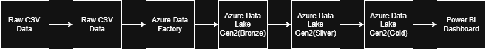
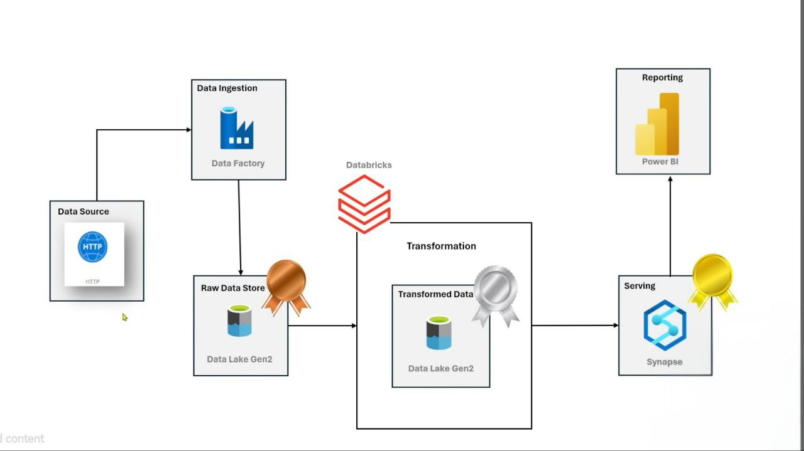

# 🚀 Azure End-to-End Data Engineering Project

## 📌 Project Overview
This project demonstrates a complete end-to-end data engineering pipeline built on Microsoft Azure.  
The pipeline ingests raw data, processes it through a medallion architecture (Bronze → Silver → Gold), stores it in a data warehouse, and visualizes insights using Power BI.

This project simulates a real-world enterprise data platform.

---

## 🏗️ Architecture

### High-Level Architecture

### Detailed Architecture

The solution follows a modern cloud data architecture:

1. Data Ingestion using Azure Data Factory
2. Data Processing using Azure Databricks (PySpark)
3. Data Storage in Azure Data Lake Gen2
4. Data Warehousing using Azure Synapse Analytics
5. Data Visualization using Power BI

Architecture Flow:

Raw Data → ADF → Data Lake (Bronze) → Databricks (Silver) → Synapse (Gold) → Power BI Dashboard

---

## 🛠️ Tech Stack

- Azure Data Factory (ADF)
- Azure Data Lake Storage Gen2
- Azure Databricks (PySpark)
- Azure Synapse Analytics
- Power BI
- Git & GitHub

---

## 📂 Project Structure

AZURE-END-TO-END-DATA-ENGINEERING-PROJECT/ 
│ 
├── ADF Pipeline/
├── Databricks-Notebooks/
├── Synapse-SQL/
├── Dataset/
├── PowerBI-Report/
├── Architecture/
└── README.md

---

## 🔄 Pipeline Steps

### 1️⃣ Data Ingestion (Bronze Layer)
- Azure Data Factory ingests raw CSV data
- Data stored in Azure Data Lake (Bronze container)

### 2️⃣ Data Transformation (Silver Layer)
- Databricks notebook performs:
  - Data cleaning
  - Type casting
  - Filtering null values
  - Aggregations

### 3️⃣ Data Warehousing (Gold Layer)
- Transformed data loaded into Azure Synapse
- SQL scripts create tables and views

### 4️⃣ Reporting Layer
- Power BI connects to Synapse
- Interactive dashboard created for analytics

---

## 🔐 Security Implementation

- Secrets are not hardcoded in the repository
- Sensitive credentials are removed
- Secure configuration recommended using:
  - Azure Key Vault
  - Databricks Secret Scopes

---

## 📊 Sample Use Case

This project analyzes sales data across multiple countries to derive:
- Total sales by country
- Regional performance
- Sales trends

---

## 🚀 Key Learnings

- Building scalable cloud data pipelines
- Implementing medallion architecture
- Secure credential management
- Integrating Azure services end-to-end
- Version control with GitHub

---

## 📌 Future Improvements

- Implement CI/CD using Azure DevOps
- Add incremental data loads
- Automate deployment with ARM templates
- Implement data quality checks

---

## 👤 Author

Devaprathap C R  
Azure Data Engineering Project